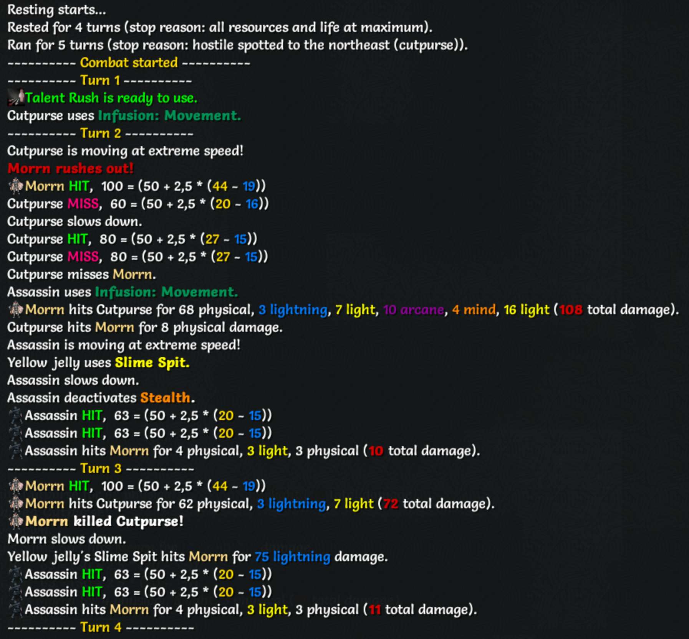

# Add Combat Turn Separators (non-intrusive)

This addon provides a compact, non-intrusive display of combat turn information in the game log. It helps you follow fights by showing turn counts and recent turn activity.

The display is intentionally lightweight and lives in the log area so it complements existing UI and other addons.



**Note:**
- Combat turns refer to player turns, i.e., each time the player gets to act.
- Combat state is determined by the player’s internal in_combat status which lasts a few additional turns after the last enemy is defeated.
- This addon removes blank lines from the log.

Contributions, bug reports, and improvements are welcome at https://github.com/cmtjk/tome-combat-turn-separators.

## Version History
```
1.0.0
- Initial release of 'tome-combat-turn-separators'.
```
